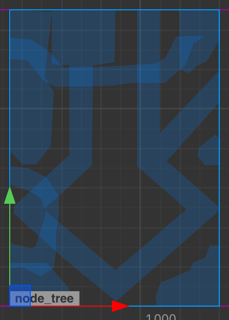
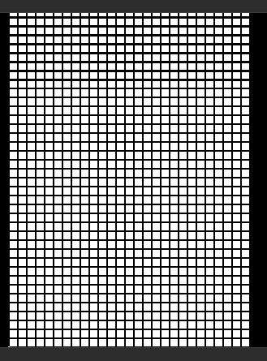
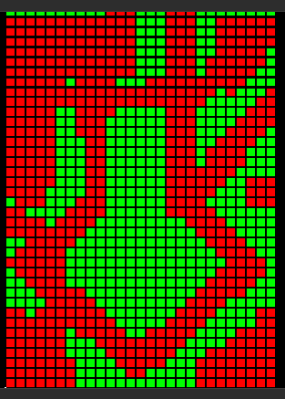
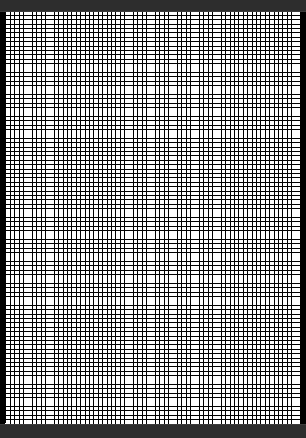
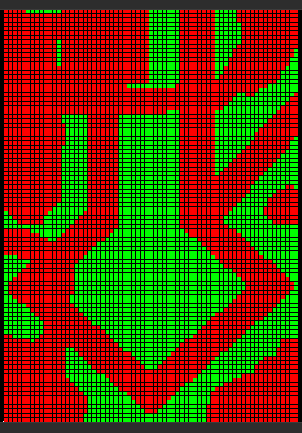

# PolyBuilder

支持任意多边形切割的可建造区域判定, 基本原理是任意多边形转成凸多边形, 凸多边形再转成三角形, 然后判定点是否在三角形内. 格子大小粒度可自由选择, 支持预计算和导入.
* 预计算 - web上运行起来后按V
* 导入 - web上运行起来后按D

# Preview
* 设计图
  

* GridSize=20拆分后
  

* 应用算法
  

* GridSize=8拆分后
  

* 应用算法
  
